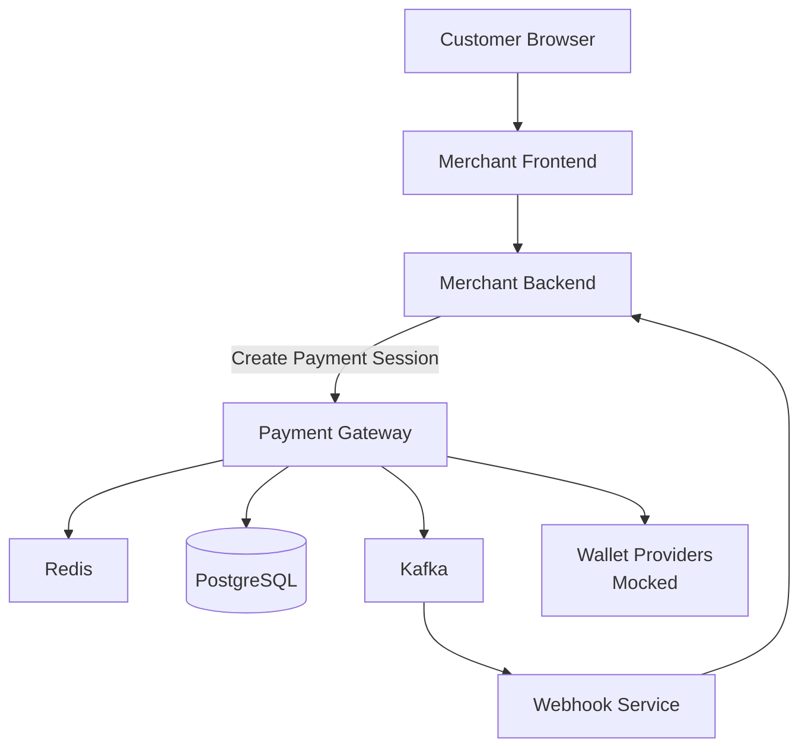

# High Level Design (HLD)

# System Overview

The system is a hosted checkout based distributed payment gateway inspired by platforms like Stripe and Razorpay.

The gateway allows merchants to:
- create payment sessions
- redirect customers to hosted checkout pages
- process wallet-based payments
- receive asynchronous webhook notifications

The system is designed with focus on:
- scalability
- fault tolerance
- idempotency
- transaction consistency
- distributed systems concepts
- event-driven architecture

---

# High Level Architecture



---

# Core Components

## Merchant Backend

Responsible for:
- creating payment sessions
- initiating payment flow
- receiving webhook events
- maintaining order state

Merchant backend communicates with gateway backend using authenticated APIs.

---

## Payment Gateway

Main orchestration layer of the system.

Responsible for:
- merchant authentication
- payment session creation
- hosted checkout rendering
- provider orchestration
- ledger updates
- transaction management
- webhook event publishing

---

## API Contracts

### Merchant Backend → Payment Gateway

#### Create Payment Session

```http
POST /payments/session
```

#### Get Payment Status

```http
GET /payments/{payment_id}
```

#### Create Refund

```http
POST /refunds
```

Authentication:
- API key
- HMAC-SHA256 signed requests

---

## Hosted Checkout

Frontend checkout page rendered by the gateway.

Responsible for:
- displaying merchant information
- displaying amount
- displaying available payment methods
- collecting payment input
- redirecting users during payment flow

The checkout page is tied to a unique payment session.

---

## Wallet Provider Layer

Responsible for:
- processing payment requests
- returning payment status
- simulating real payment providers

For MVP:
- providers will be mocked internally

Supported mock providers:
- Mobikwik
- Paytm Wallet
- PhonePe

---

## PostgreSQL

Primary source of truth.

Responsible for storing:
- merchants
- payment sessions
- transactions
- ledger entries
- refunds
- webhook events

Financial consistency is maintained using PostgreSQL transactions.

---

## Redis

Responsible for:
- idempotency handling
- temporary session caching
- rate limiting
- distributed locking

Redis improves performance and prevents duplicate payment processing.

---

## Kafka

Responsible for asynchronous event processing.

Used for:
- webhook delivery
- retry handling
- audit logging
- notification events

Kafka decouples synchronous payment processing from background workflows.

---

## Webhook Service

Responsible for:
- delivering payment events to merchants
- retrying failed webhook deliveries
- signing webhook payloads

Supported events:
- payment.success
- payment.failed
- refund.completed

Webhook retry strategy:
- exponential backoff
- maximum 5 retry attempts

---

# Payment Session Flow

## Step 1 - Customer Starts Checkout

Customer clicks:

```text
Pay Now
```

on merchant website.

---

## Step 2 - Merchant Backend Creates Session

Merchant backend sends:

```http
POST /payments/session
```

to gateway backend.

Gateway validates:
- merchant credentials
- request signature
- payload integrity

---

## Step 3 - Gateway Creates Payment Session

Gateway creates:
- payment_id
- session_id

Initial payment state:

```text
CREATED
```

Payment session is stored in PostgreSQL.

---

## Step 4 - Gateway Returns Checkout URL

Gateway returns:

```text
https://gateway.com/checkout/session_123
```

Merchant frontend redirects customer browser to hosted checkout page.

---

## Step 5 - Hosted Checkout Renders

Gateway frontend displays:
- merchant information
- payment amount
- available wallet providers

Customer selects payment method.

---

## Step 6 - Gateway Communicates With Wallet Provider

Gateway sends payment request to selected wallet provider.

Provider may return:
- success
- failure
- timeout
- delayed confirmation

---

## Step 7 - Gateway Updates Transaction State

Gateway:
- updates payment status
- creates ledger entries
- stores transaction records

---

## Step 8 - Kafka Event Publishing

Gateway publishes events to Kafka.

Example events:
- payment.success
- payment.failed
- refund.created

---

## Step 9 - Webhook Delivery

Webhook service sends payment status updates to merchant backend.

Failed webhook deliveries are retried asynchronously.

---

## Step 10 - Customer Redirect

Customer browser is redirected back to merchant success/failure page.

---

# Database Usage

## PostgreSQL Tables

Initial tables:
- merchants
- payment_sessions
- transactions
- ledger_entries
- refunds
- webhook_events

---

## Financial Consistency

Critical financial operations should remain transactional.

Example:
- debit customer
- credit merchant
- update transaction status

All should happen atomically.

---

# Redis Usage

Redis will be used for:

## Idempotency

Prevent duplicate payment processing during retries.

---

## Rate Limiting

Protect public APIs from abuse.

---

## Distributed Locking

Prevent concurrent updates on same payment session.

---

## Session Caching

Improve hosted checkout performance.

---

# Kafka Usage

Kafka will be used for asynchronous workflows.

## Example Events

- payment.created
- payment.success
- payment.failed
- refund.created
- webhook.retry

---

## Why Kafka?

Kafka helps:
- decouple services
- improve scalability
- improve retry handling
- support asynchronous workflows

---

# Reliability Strategy

## Retry Handling

System should safely retry:
- provider failures
- webhook failures
- temporary infrastructure failures

---

## Idempotency

Repeated requests with same idempotency key should not create duplicate payments.

---

## Failure Recovery

System should safely recover from:
- provider downtime
- service crashes
- Redis failures
- Kafka failures

---

# Scalability Strategy

Initial MVP will use modular monolith architecture.

Internally separated modules:
- merchant module
- payment module
- ledger module
- wallet module
- webhook module

Future versions may split into microservices if scaling requirements increase.

---

# Security Considerations

## Merchant Authentication

All merchant APIs require:
- API key
- signed requests

---

## Secure Secret Storage

API secrets should never be stored in plain text.

Secrets should be hashed or encrypted securely.

---

## Webhook Verification

Webhook payloads should be signed securely.

Merchant backend must verify webhook signatures before processing webhook events.

---

# Observability

## Logging

System should support structured application logging.

Example logs:
- payment created
- payment failed
- webhook retry
- provider timeout

---

## Metrics

System should expose metrics for:
- payment success rate
- API latency
- webhook retry count
- provider failure count

---

## Monitoring

Future versions may integrate:
- Prometheus
- Grafana

for metrics visualization and monitoring dashboards.

---

# Testing Strategy

## Unit Testing

System should support unit testing for:
- payment logic
- ledger operations
- idempotency handling
- retry logic

---

## Integration Testing

System should support:
- end-to-end payment flows
- database transaction testing
- API contract validation

---

## Failure Testing

System should test:
- provider downtime
- Redis unavailability
- webhook failures
- retry handling

---

# Performance Goals

Target goals for MVP:
- payment session creation latency < 200ms
- webhook success rate > 99%
- duplicate payment prevention reliability > 99.99%

---